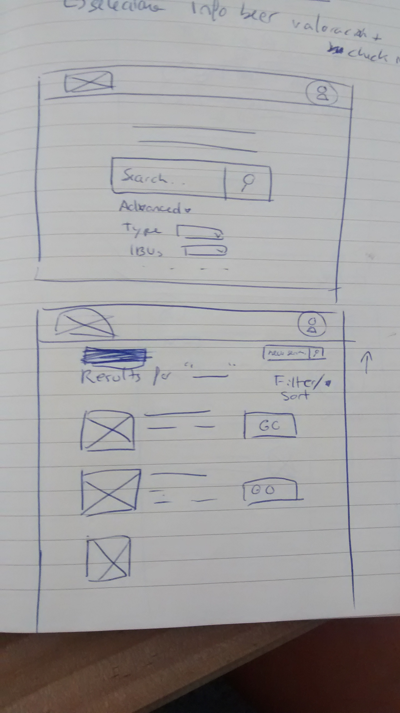

#STAGE 1
1. request beer API
2. search for a beer
3. list beer results
4. filter the results if convenient
5. select a beer
6. set favorite if you liked the beer
7. when click at profile icon, list favorite beers saved

##Specifications stage 1
**Home page (1st. Global view)** 
+ search form
+ advanced filter (type of beer, brand)
+ show list of results according to key word
+ click 1 result

**Beer page (2nd. Global view)**
+ show beer specifications 
+ drink/like button 
+ rating button (1 to 10)
+ set/save date of likes
+ when click user icon, show favorites (according to like button)
+ sort out the favorite list according to rating, date or type

#STAGE 2
1. when drinking a beer in a bar, click the checkout button and take the coordinates
2. display a map with near places to select your bar.
3. take a picture of the place/moment

##Specifications stage 2
+ button location (bar location)
+ ask for user permission to take coordinates
+ links the information with google or 4square API
+ display a map with nearest bar places
+ select the bar
+ create button to take picture 
+ load 1 picture and can't modify in the future
+ create a button to link another person (for example if he/she is in the bar)

#STAGE 3
1. log in/sign in user
2. generates a global view and a __user view__

##Specifications stage 3
+ create a form for the user
+ buttons are active (drunk/location/with who/rating.
+ if user hasn't logged in, message to log/sign in.
+ user view displayed
+ default view: list of different kind of beers you've drunk, (from most recent to old ones).
+ filter menu to customize view according to ratings, type of beer, date, alphabetically, locations

#STAGE 4
1. save the beers that you've drunk
2. log in/sign in with Facebook or Google
