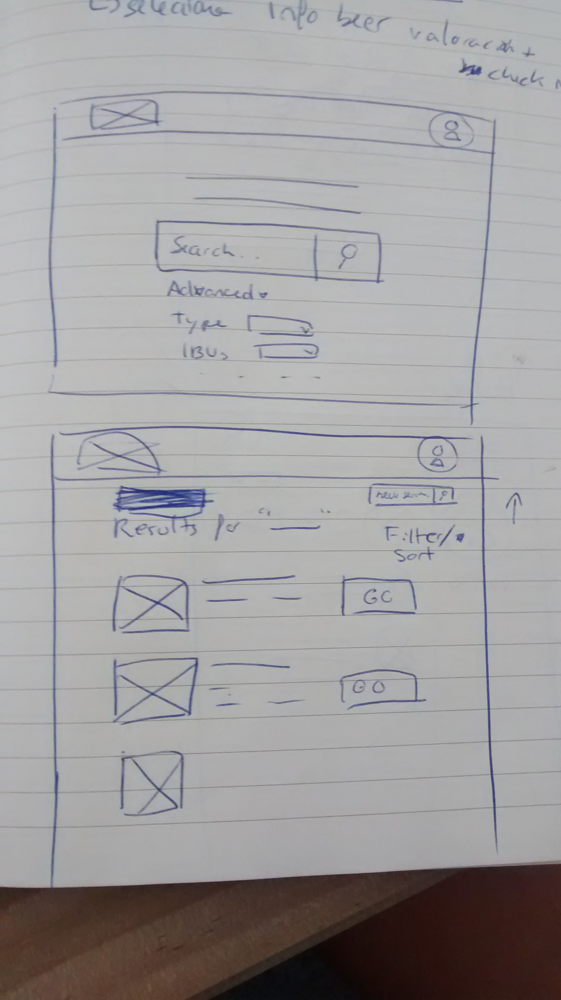
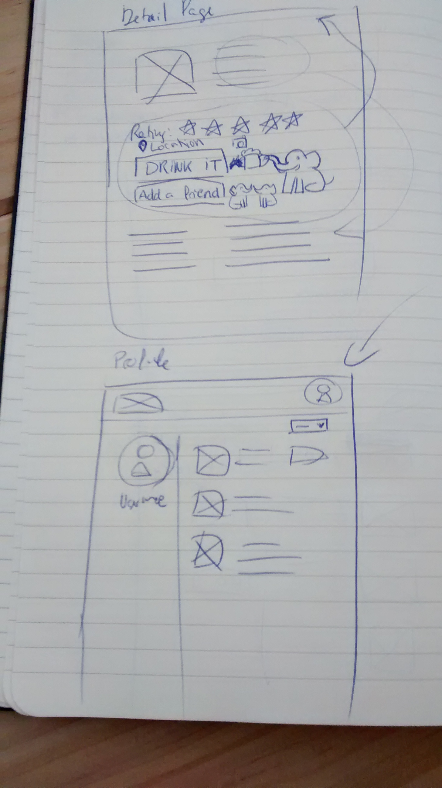

DUMBEER.COM

https://instantdomainsearch.com/#search=dumbeer 

1ª fase
Pedir API al directorio, mostrar los resultados, hacer paginación, poder navegar, ver siguiente, como filtrar resultados, marcarla como favoritos. Tener sección con angular buscar y favoritos. Mostrar la info de los favoritos.

Consultar las cervezas de la api. 
Eta me gusta. Poder guardar mi favorita. 

2ºfase
poder adjuntar mapa de las cervezas. Esta cerveza me la he bebido en este sito. Mostrar las coordenadas y en un mapa.
Poder añadir fotos (api dropbox), o timeline (poner fecha y que se muestre en un timeline).

3ª fase. Gestión de usuario. Detectar diferentes usuarios. 
Formulario asociar inputs a usuario. Podemos generar usuarios. 
Tenndremos una vista de usuario y una vista global.

Fase 4ª 
 Filtrar los favoritos, etc. 

Fase 5ª
Hacer login con react, google. 
Guardar las cervezas que te has tomado
logarte con facebook

Especificaciones 1ª fase

Especificaciones 2ª fase
- pedir permiso 
- te lista varios sitios cercanos 
- seleccionas el sitio
- se linka con el 4square o googlemaps.
- botón añadir foto (máximo 1 foto)

Especificaciones 3ª fase
- crear un formulario para login
- cuando hacemos login podemos hacer drink-it / localización / con quien te la has tomado / puntuación. Si no te has logado 
- sale el perfil del usuario. Por defecto te sale una lista de cervezas que te has tomado ordenadas cronológicamente de más reciente a menos reciente. Hay la posibilidad de ordenarla con otros criterios (algfabéticamente, por valoración).
- fecha / valoración/ donde te lo has tomado

Instrucciones
Crear readme.md => 
=>explicar qué contiene la app

contexto (nobre, fecha y componentes del proyecto).
Crear sección team members. Lo debe llenar cada uno por separado. 

Por ejemplo: ponemos datos => git push=> otro miembro hace git pull=> ponemos datos=> guit commit y guit push.

Crear repositorio y añada a los colaboradores
subir las especs al proyecto
todos nos podamos clonar el repo a nuestra máquina

Si sobra tiempo: timeline